# 16825: Learning For 3D Vision
## Project 3 Results - Vinayak Patel (vinayakp)

------------------------------------------------------------------------------------------------------------------------------ 
### Navigating this repository

Relevant Files:   
./Assignment_README/README.md - Contains the original instructions for this assignment. 
surface_rendering_main.py     - Main file for training, rendering and saving Neural Surfaces.  
volume_rendering_main.py      - Main file for training, rendering and saving Volumes.  
dataset.py                    - To download and save the necessary input dataset. 
implicit.py                   - Contains the classes for NeRF, Neural Surface and Hierarchical NeRF (coarse and fine sampling). 
renderer.py                   - To render Volume, Volume SDF and Sphere Tracing.  

------------------------------------------------------------------------------------------------------------------------------ 

### A. Neural Volume Rendering
### 0. Transmittance Calcultion

    <figure style="display:inline-block; text-align:center; margin:10px;">
        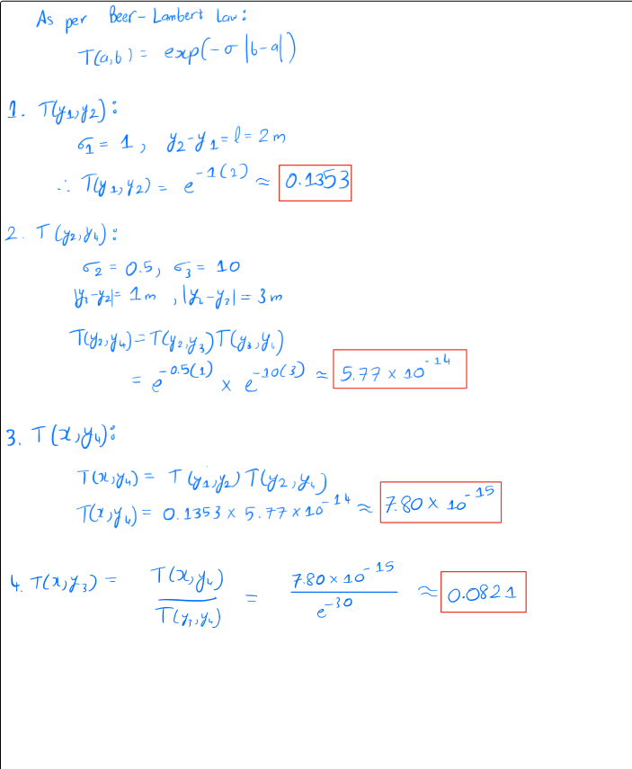
        <figcaption>Transmittance Calculation Answer</figcaption>
    </figure>

### 1. Differentiable Volume Rendering
### 1.3. Ray Sampling 

    <figure style="display:inline-block; text-align:center; margin:10px;">
        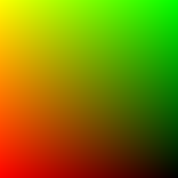
        <figcaption>XY Grid</figcaption>
    </figure>
    <figure style="display:inline-block; text-align:center; margin:10px;">
        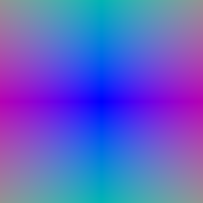
        <figcaption>Rays</figcaption>
    </figure>

### 1.4. Point Sampling

    <figure style="display:inline-block; text-align:center; margin:10px;">
        
        <figcaption>XY Grid</figcaption>
    </figure>

### 1.5. Volume Rendering

    <figure style="display:inline-block; text-align:center; margin:10px;">
        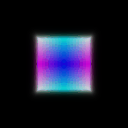
        <figcaption>Part 1 Volume Rendering</figcaption>
    </figure>
    <figure style="display:inline-block; text-align:center; margin:10px;">
        
        <figcaption>Normalized Depth</figcaption>
    </figure>

### 2. Optimizing a Basic Implicit Volume
### 2.3. Visualization

    <figure style="display:inline-block; text-align:center; margin:10px;">
        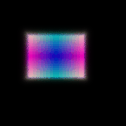
        <figcaption>Part 2 Volume Rendering</figcaption>
    </figure>

### 3. Optimizing a Neural Radiance Field (NeRF)

    <figure style="display:inline-block; text-align:center; margin:10px;">
        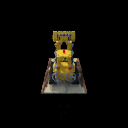
        <figcaption>Part 3 NeRF Lego Rendering</figcaption>
    </figure>

### 4. NeRF Extras
### 4.1. View Dependence

    <figure style="display:inline-block; text-align:center; margin:10px;">
        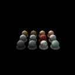
        <figcaption>Part 4.1 View Dependent Materials Rendering</figcaption>
    </figure>

By using view dependence, I noticed that the NeRF gave me output which had better reflections and highlights, both of which are view dependent effects. It was like turning of Ray Traced Reflections and Shadows in Cyberpunk 2077 or any other recent AAA game. These reflections and highlights made the rendering more appealing and photo-realistic.   
Although, this boost to photo-realism comes with some obvious downsides.    
1. Computation Time: I was running all of the code and training locally using CUDA on my Nvidia Laptop RTX 4060 GPU and found that rendering each image in this scene took 30-35 seconds more than rendering the scenes in the prevoius parts (which were close to 5-10 seconds per image).    
2. Testing on Scenes with drastically different lighting than trained data: The trained NeRF model has a very high chance to lose accuracy and give higher loss when testing on data which has significantly different lighting than the training and validation data. In the case of mirror like or highly reflective materials, the highlights in the scene depend heavily on the lighting conditions. And as the model is capturing lighting information from the training data, it may not be able to accurately predict scene highlights if the lighting conditions of the test data is different from what the model is trained on and accustomed to.    
3. Overfitting: View dependent models have a tendency to learn and memorize training scenes/views rather than learning the features underneath that make up the scene. This essentially means that the model has a high chance to overfit to the training data. Although, a potential way that I implemented to prevent it was using a dropout layer of 0.1 i.e 10% probability of a neuron to be dropped out for a particular forward and backward pass.    

Thus, increasing view dependence leads to loss of generalization in NeRF models.  

### 4.2. Coarse/Fine Sampling

    <figure style="display:inline-block; text-align:center; margin:10px;">
        
        <figcaption>Part 3 NeRF Lego Rendering</figcaption>
    </figure>
    <figure style="display:inline-block; text-align:center; margin:10px;">
        
        <figcaption>Part 4.2 Hierarchical Sampling based NeRF Lego Rendering</figcaption>
    </figure>

For most cases involving a NeRF implementation, a Hierarchical or Coarse+Fine Sampling can help us to maintain accuracy of the model while potentially reducing computational cost. This is because coarse sampling focuses mainly on important regions near the surface of the objects and uses fine sampling on regions where there is more complex geometry or occlusion present. The course sampling helps speed up the training whereas the fine sampling doesn't compromise on losing accuracy and samples effectively where it is required. Such effective sampling helps in improving the quality of the render if not maintaining it as compared to a regular NeRF model.    
As for the trade-offs, Hierarchical Sampling can sometimes increase the computational complexity if the scene is complex enough and requires fine sampling at most of the time. And as 2 networks are running at the same time, the lack of parallelization in some systems can lead to significantly longer training time.    
Moreover, tuning the parameters for both the networks is more tricky and it is crucial to appropriately allocate the number of coarse and fine samples in order to make full use of the efficiency that hierarchical rendering can provide us.

### B. Neural Surface Rendering
### 5. Sphere Tracing

    <figure style="display:inline-block; text-align:center; margin:10px;">
        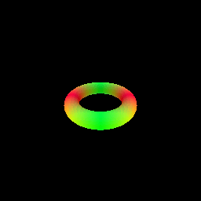
        <figcaption>Part 5 Sphere Tracing based Torus Surface Rendering</figcaption>
    </figure>

For my torus surface rendering implementation based on sphere tracing, I have used dynamic distance values when travelling along a ray (originating from the camera) which moves faster in empty space (by taking longer steps) and slows down (takes shorter steps) when reaching near a surface. This is more efficient and even more accurate than having steps of fixed length/distance. The rays converge if they get too close to a surface (i.e. SDF=0) or if they reach a maximum distance. The sphere tracing process stops once all rays have converged or terminated. Appropriate convergence criterias were implemented so that the rendering doesn't have many artifacts. Further by leveraging batch processing, I was able to parallely process multiple rays. The dynamic step size led to much sharper rendering while using less overall steps per ray compared to methods like volume rendering. 

### 6. Optimizing a Neural SDF

    <figure style="display:inline-block; text-align:center; margin:10px;">
        
        <figcaption>Part 6 Input</figcaption>
    </figure>
    <figure style="display:inline-block; text-align:center; margin:10px;">
        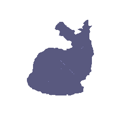
        <figcaption>Part 6 Output Rendering</figcaption>
    </figure>

The MLP that I created for this part consist take 3D coordinates as input and give signed distance to nearest surface as output. Positional Encoding was used to capture finer details and hidden layers were used which had skip connections to preserve both global and local level information.    
For the Eikonal Loss part, the goal was to constrain the gradient of the distance field to a magnitude of 1. I implemented this by first computing gradients of the predicted distance with respect to input points using PyTorch's autograd. Then, I computed the squared difference between each gradient's magnitude and 1.0 while taking the mean across all points.This transforms arbitrary network outputs into proper distance functions, enables accurate surface and normal reconstruction which make physical sense.

### 7. VolSDF

    <figure style="display:inline-block; text-align:center; margin:10px;">
        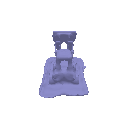
        <figcaption>Part 7 Geometry</figcaption>
    </figure>
    <figure style="display:inline-block; text-align:center; margin:10px;">
        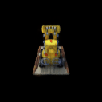
        <figcaption>Part 7 VolSDF Rendering</figcaption>
    </figure>

Alpha tells us about the level of opaqueness of the surface. High alpha value implies opaque object and low alpha values imply transparent surfaces.    
Beta is related to the intensity of transition between inside and outside the surface. It signifies how quickly density changes as we move away from the surface boundary.    

1. High beta leads to smoother, more gradual transitions around the surface, resulting in thicker, blurrier surfaces with rounded features. Whereas low beta creates sharp, abrupt transitions resulting in thin, sharp surfaces that better preserve features and details.    

2. When beta is set high, the network receives learning signals even when its predictions are far from the true surface, preventing vanishing gradients during early training stages. This makes the optimization processes smoother as it creates wider regions of meaningful gradients. Hence, it is easier to train an SDF with "high beta".    

3. We will be more likely to learn accurate surface using a lower beta value as it preserves geometric features and details. It also causes less blurring due to it creating tighter fit to true surfaces. However, to mitigate the possibility of vanishing gradient problem, we should start with a higher beta value and then move towards lower beta values during later stages of training closer to the surface.    

I achieved my best results using a combination of low beta (0.05) and high alpha (10.0), which created sharp, well-defined surfaces with strong opacity. The low beta value allowed the model to capture fine geometric details of the Lego model, while the relatively high learning rate (0.0005) with gradual decay (gamma=0.8) led to effective optimization without trapping itself in local minima. The balance between eikonal regularization (0.02) and intersection regularization (0.1) was crucial and just constrained enough to learn a proper SDF while allowing flexibility to match the complex Lego geometry. My configuration worked well as it maintained the precise fit to the actual shape while the surface render was detailed and realistic. 

### 8. Neural Surface Extras
### 8.1. Render a Large Scene with Sphere Tracing

    <figure style="display:inline-block; text-align:center; margin:10px;">
        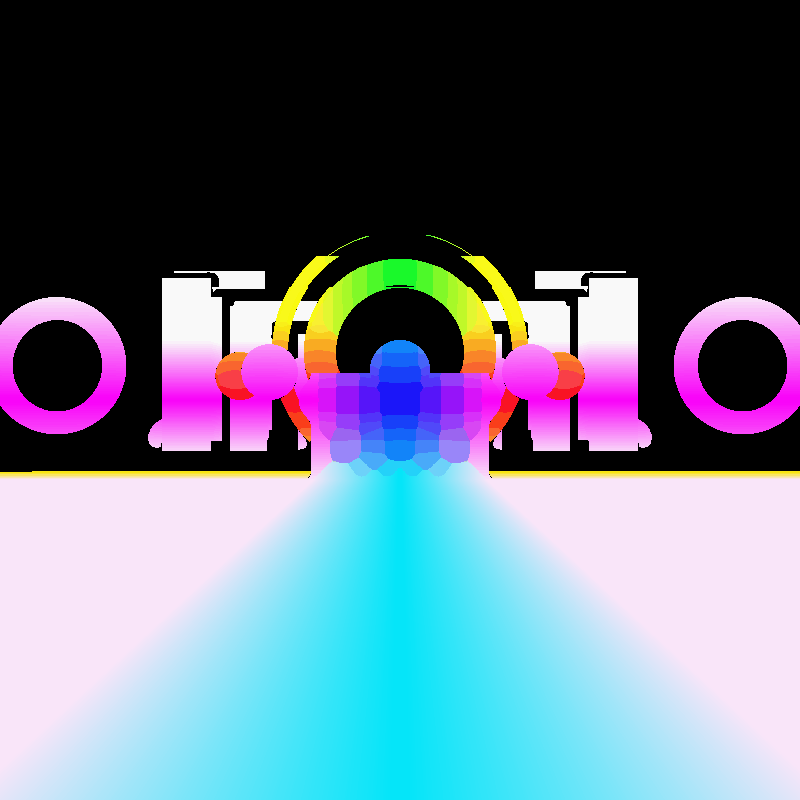
        <figcaption>Part 8 Large Scene Rendering</figcaption>
    </figure>

I could not further increase the resolution of the image as I started encountering CUDA Out of Memory error even after killing useless processes detected through nvidia-smi. But I feel that this is good enough.

### 8.2. Fewer Training Views

    <figure style="display:inline-block; text-align:center; margin:10px;">
        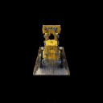
        <figcaption>Part 8.2 NeRF Rendering with 20 views</figcaption>
    </figure>
    <figure style="display:inline-block; text-align:center; margin:10px;">
        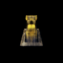
        <figcaption>Part 8.2 VolSDF Rendering with 20 views</figcaption>
    </figure>

